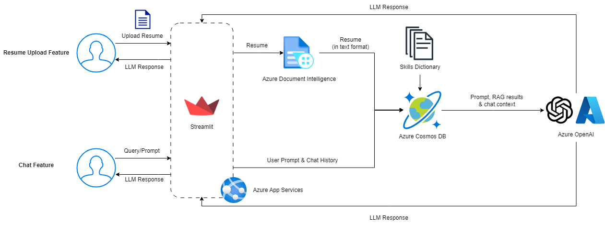
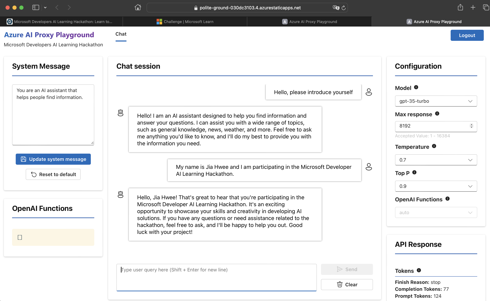
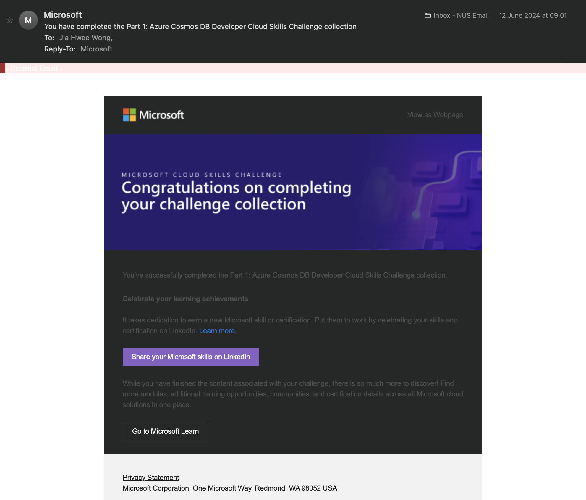
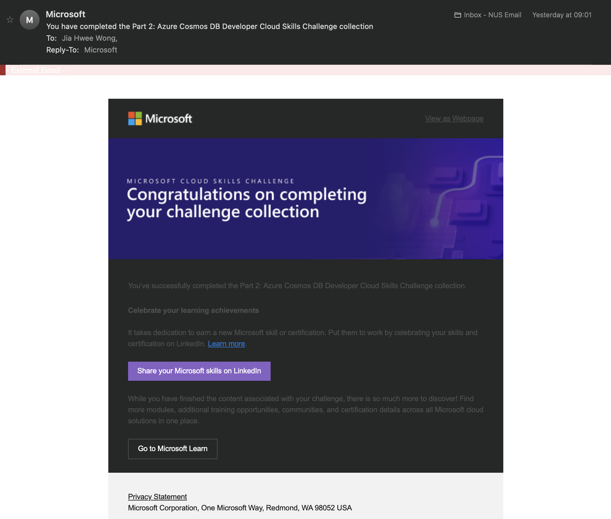
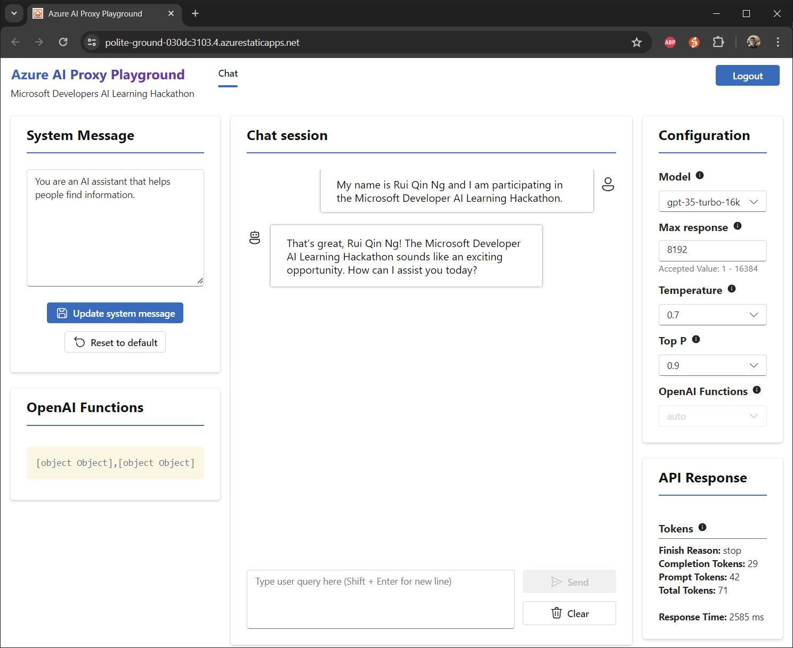
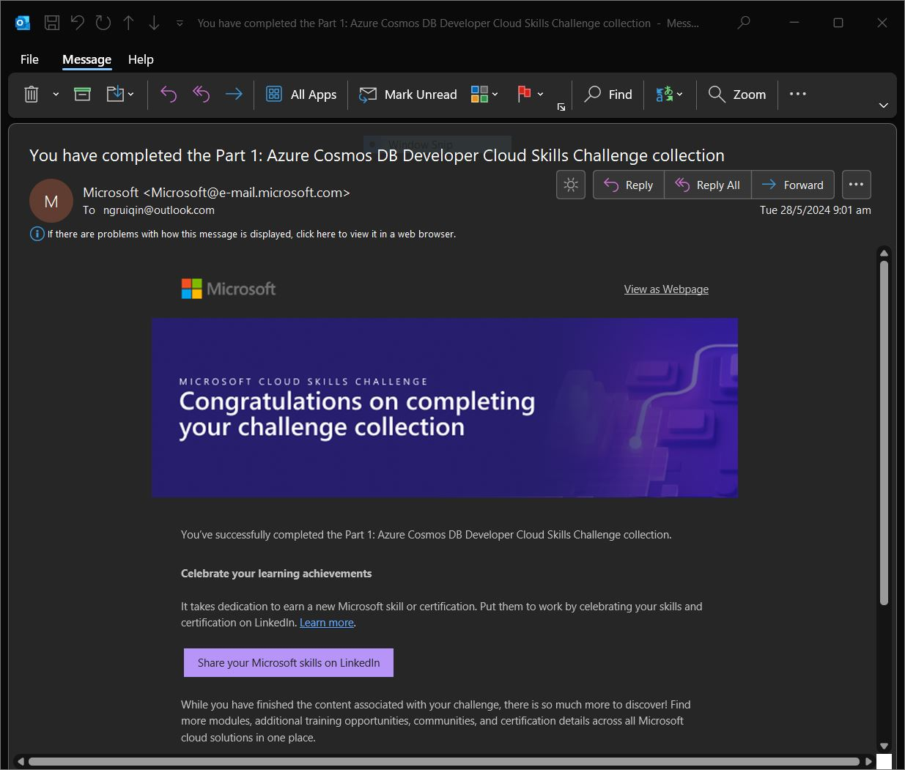
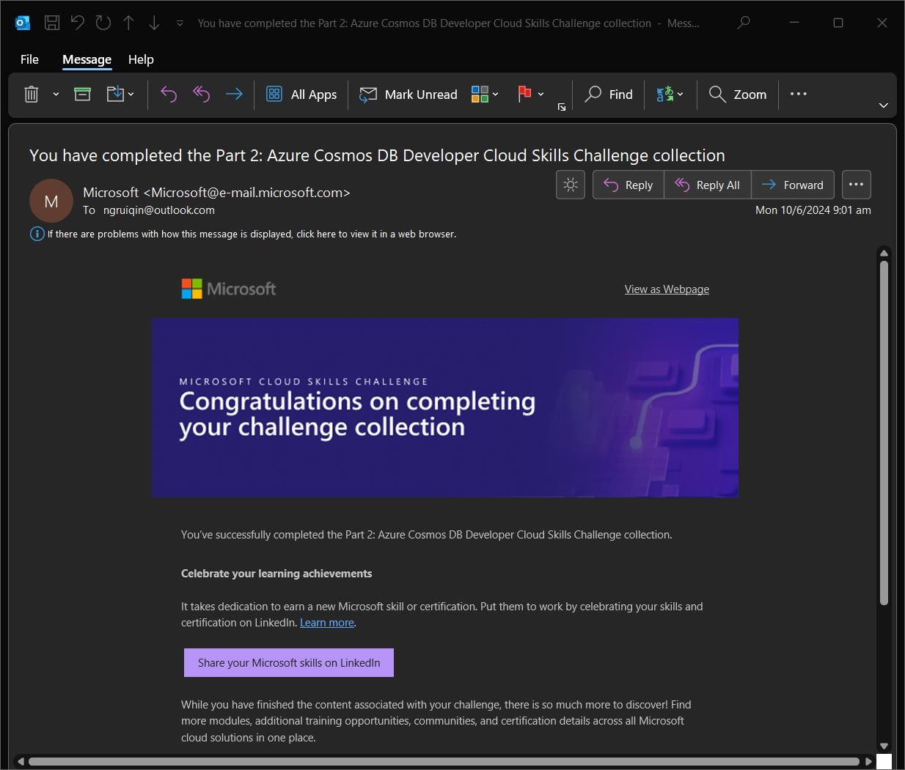

# Raisume: Smart Skillsistant that Identifies and Infers Skills from Resumes

Human Resources (HR) recruiters play a pivotal role in selecting and hiring the right candidates to drive company growth. This task is challenging, as recruiters must quickly strategize and fill open positions while managing the interview process with hiring managers (TalentEdge, 2024). Additionally, recruiters face the daunting task of sifting through an average of 250 applications for every job opening (Glassdoor, 2016), making the selection process even more demanding. Furthermore, recruiters face difficulties in finding candidates that possess skills that matches with the job description. (Godbersen, 2023)

To address these challenges, we developed Raisume, or Rais, an Azure AI-powered application designed to streamline the resume filtering process for HR professionals.

## Use Cases

### Summarise Skills Written in Resumes

Rais intelligently identifies and extracts skill keywords from resumes, presenting them in a concise, readable tabular format. Recruiters simply upload resumes into Rais, and the app handles the rest, eliminating the need for manual keyword searches.

Rais achieves this by first using Azure's Document Intelligence to convert resumes into text format. This text is then passed to Azure CosmosDB, which searches for contextual data. Finally, the text and contextual data are fed into Azure OpenAI's GPT-3.5-Turbo, which identifies and extracts all relevant skills.

### Answer Queries Related to Skills

Rais also functions as a smart assistant, capable of answering questions about skills. In the fast-changing job market, HR recruiters may struggle to keep up with emerging trends and technical jargon. With Rais, recruiters can ask questions to clarify these terms, helping them assess their relevance to specific roles.

Azure CosmosDB maintains a dynamic database of relevant skills, which serves as a grounding data source, providing contextual knowledge to Rais. The core of Rais's functionality is powered by Azure OpenAI's GPT-3.5-Turbo, which uses the recruiter’s queries and the contextual knowledge from Azure CosmosDB to deliver precise and relevant responses.

## System Design

We utilised the following resources and datasets for Raisume:
- Azure App Services to seamlessly host updated versions of Raisume, built with Streamlit, with GitHub Actions for CI/CD
- Azure Document Intelligence (layout model) to accurately extract plain text from documents
- Skills Dataset (from Skill Extractor Cognitive Search) as documents for the RAG: https://github.com/microsoft/SkillsExtractorCognitiveSearch/blob/master/data/skills.json
- Azure Cosmos DB, as a RAG, to store skills from the Skills Dataset, generate embeddings for each skill and perform vector searches for prompts/documents
- Azure OpenAI to identify and infer skills from the prompt, results from the RAG and chat context

## Functionalities

### Resume Analyzer

- Document intelligence
- prompt engineering
- RAG with cosmos db
- openai force json

### Chat

- Prompt engineering
- RAG with cosmos db (refer to previous section)
- openai (with response streaming)
- Diagram for message flow

### Chat History

- Aggregating all messages together in one view

## Challenges Faced

- SKU S0
- Error 422 invalid string
- Error 500 from ChatGPT
- Tokens exceeded

## Future Work
**Resume and Job Description Matching & Analytics**

Future enhancements for Rais include capabilities for resume and job description matching and advanced analytics. By leveraging Azure CosmosDB to store resumes and job descriptions, Rais can be further developed to filter applicants for specific roles or groups of similar roles. Additionally, Rais can perform trend and demographic analysis on applicant data, providing valuable insights for HR departments.

**Applicant-Facing Features**

Rais can be expanded to assist applicants in finding the open job roles most relevant to their resumes, eliminating the need to browse through the company hiring portal. Moreover, Rais can answer any questions applicants may have about job descriptions and the company itself, providing a comprehensive and user-friendly experience.

## Rais It Now!

App URL: https://azurecosmosdb-hackathon-eyc4g2chfgdbfhdg.eastus-01.azurewebsites.net/

## Phase 1 Screenshots

## References

Glassdoor, 2016. Why Is Hiring So Hard for Employers Right Now? https://www.glassdoor.com/research/why-is-hiring-so-hard-right-now

Godbersen, 2023. 10 pain points of HR recruiters in large corporations and how Executive Search Firms can make their life easier: https://frankgodbersen.com/10-pain-points-of-hr-recruiters-in-large-corporations-and-how-executive-search-firms-can-make-their-life-easier/

TalentEdge, 2024. What is the Role of an HR Recruiter? https://talentedge.com/articles/what-is-the-role-of-a-hr-recruiter/